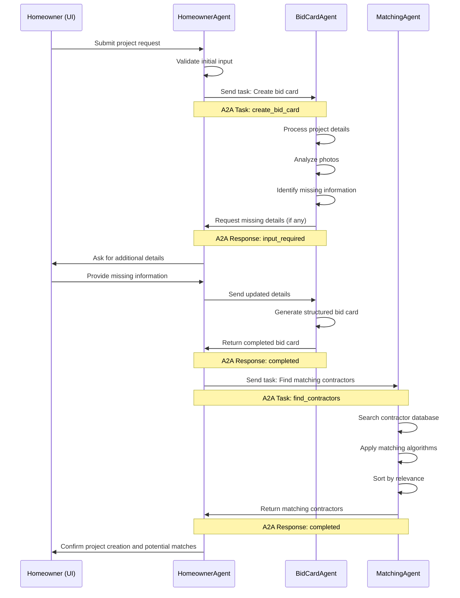
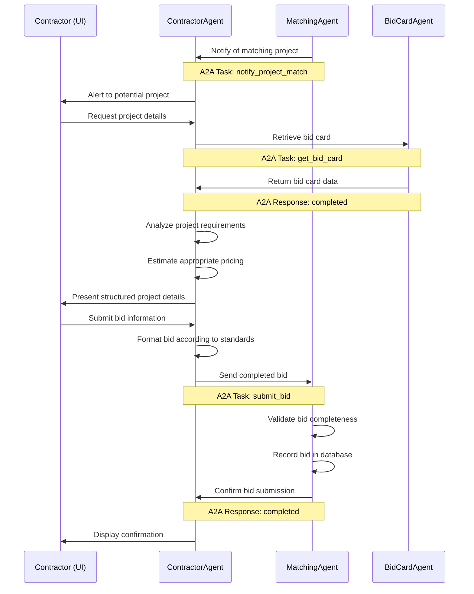
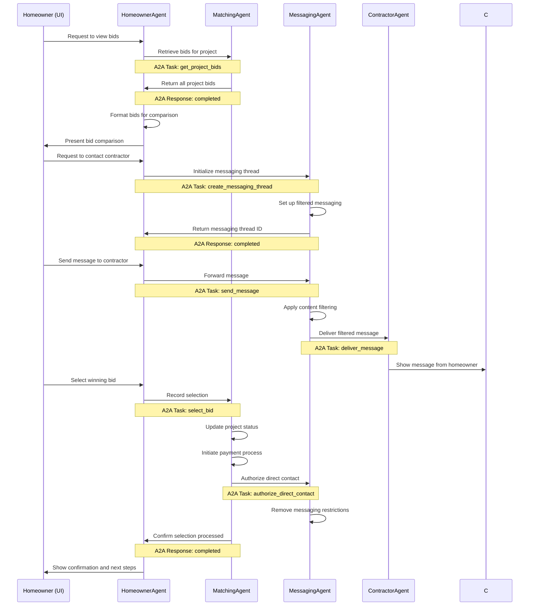
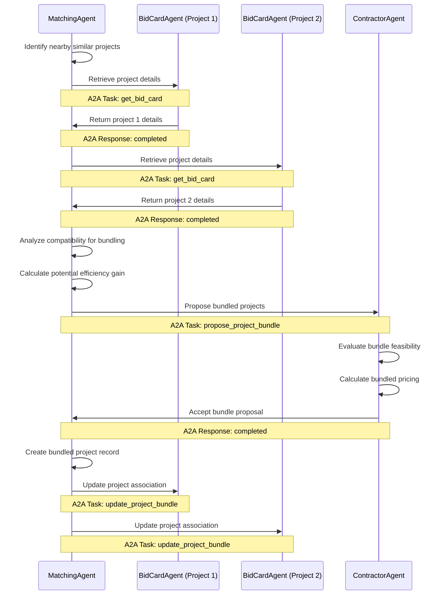
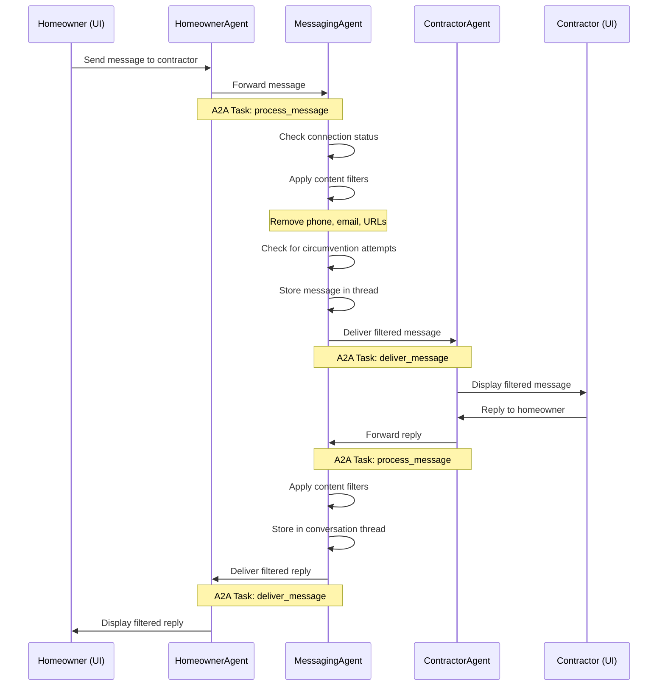
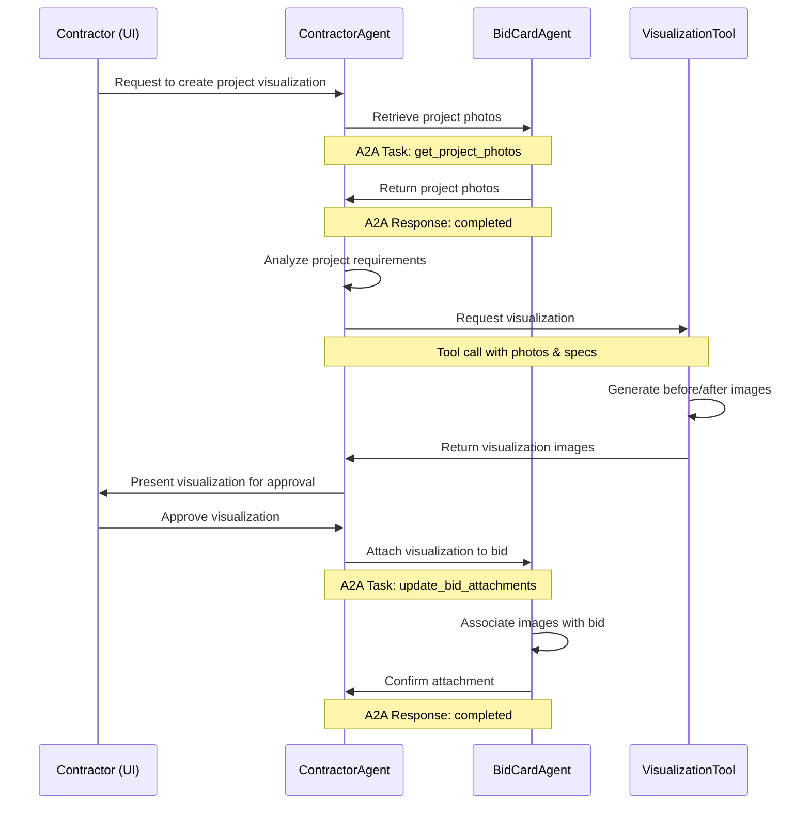
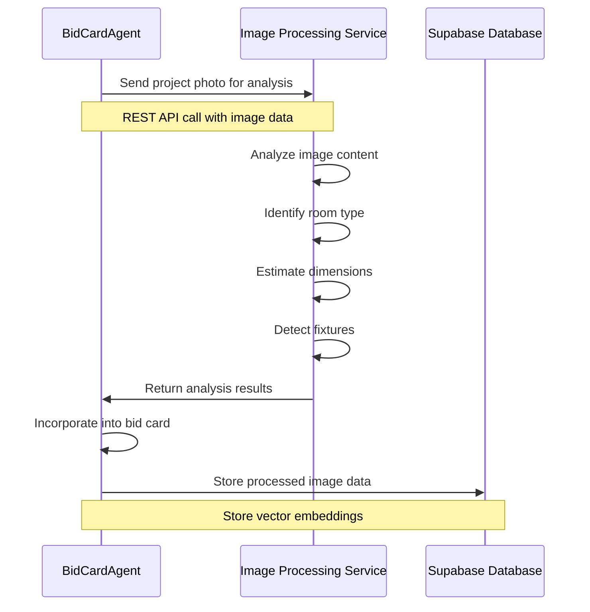

# InstaBids Agent Interaction Flows

This document details the interaction patterns between agents in the InstaBids platform using the A2A protocol. These flows represent the core business processes and demonstrate how agents collaborate to deliver platform functionality.

## 1. Project Creation Flow



## 2. Contractor Bidding Flow



## 3. Homeowner Review and Selection Flow



## 4. Project Bundling Flow



## 5. Messaging Flow with Filtering



## 6. Project Visualization Flow



## 7. Agent State Transitions

Each A2A task follows this lifecycle:

1. **Submitted**: Initial task received by agent
2. **Working**: Agent actively processing the request
3. **Input-Required**: Agent needs additional information (creates multi-turn interaction)
4. **Completed**: Task successfully finished
5. **Failed**: Task could not be completed
6. **Canceled**: Task terminated by request

Example state transitions for a bid card creation task:

```mermaid
stateDiagram-v2
    [*] --> Submitted: Task initiated
    Submitted --> Working: BidCardAgent processing
    Working --> Input-Required: Missing project details
    Input-Required --> Working: Details provided
    Working --> Completed: Bid card created
    Working --> Failed: Invalid project type
    Submitted --> Canceled: User cancels request
    Completed --> [*]
    Failed --> [*]
    Canceled --> [*]
```

## A2A Message Structure Examples

### 1. Task Submission (HomeownerAgent to BidCardAgent)

```json
{
  "jsonrpc": "2.0",
  "id": "task-12345",
  "method": "tasks/send",
  "params": {
    "id": "bid-card-task-67890",
    "message": {
      "role": "user",
      "parts": [
        {
          "type": "text",
          "text": "Create a bid card for a bathroom renovation project"
        },
        {
          "type": "data",
          "data": {
            "projectType": "bathroom_renovation",
            "location": {
              "city": "Austin",
              "state": "TX",
              "zip": "78704"
            },
            "timeline": {
              "startDate": "2025-07-01",
              "endDate": "2025-08-15"
            },
            "budget": {
              "min": 15000,
              "max": 25000,
              "currency": "USD"
            },
            "description": "Full renovation of master bathroom, including new shower, tub, vanity, and tile work."
          }
        },
        {
          "type": "file",
          "file": {
            "name": "bathroom_current.jpg",
            "mimeType": "image/jpeg",
            "bytes": "base64EncodedImageData..."
          }
        }
      ],
      "metadata": {
        "userId": "homeowner-123",
        "projectId": "project-456"
      }
    }
  }
}
```

### 2. Task Response (BidCardAgent to HomeownerAgent)

```json
{
  "jsonrpc": "2.0",
  "id": "task-12345",
  "result": {
    "id": "bid-card-task-67890",
    "status": {
      "state": "input-required",
      "message": {
        "role": "agent",
        "parts": [
          {
            "type": "text",
            "text": "Additional information needed: What are the dimensions of the bathroom? Do you want to keep the current layout or change it? Are there any specific fixtures or finishes you prefer?"
          }
        ]
      },
      "timestamp": "2025-04-19T15:30:45Z"
    }
  }
}
```

### 3. Completed Task (BidCardAgent to HomeownerAgent)

```json
{
  "jsonrpc": "2.0",
  "id": "task-12345",
  "result": {
    "id": "bid-card-task-67890",
    "status": {
      "state": "completed",
      "message": {
        "role": "agent",
        "parts": [
          {
            "type": "text",
            "text": "Bid card successfully created for your bathroom renovation project."
          },
          {
            "type": "data",
            "data": {
              "bidCardId": "bid-card-789",
              "projectType": "bathroom_renovation",
              "location": {
                "city": "Austin",
                "state": "TX",
                "zip": "78704",
                "coordinates": {
                  "lat": 30.2500,
                  "lng": -97.7500
                }
              },
              "timeline": {
                "startDate": "2025-07-01",
                "endDate": "2025-08-15",
                "estimatedDuration": "6 weeks"
              },
              "budget": {
                "min": 15000,
                "max": 25000,
                "currency": "USD"
              },
              "specifications": {
                "dimensions": {
                  "length": 12,
                  "width": 8,
                  "height": 9,
                  "unit": "feet"
                },
                "fixtures": ["shower", "tub", "vanity", "toilet"],
                "materials": ["ceramic tile", "glass shower door"],
                "layout": "existing layout with modifications",
                "special_requirements": "ADA compliant fixtures preferred"
              },
              "photos": [
                {
                  "id": "photo-123",
                  "type": "current_state",
                  "url": "/project-images/bathroom_current.jpg"
                },
                {
                  "id": "photo-124",
                  "type": "reference_style",
                  "url": "/project-images/bathroom_reference.jpg"
                }
              ]
            }
          }
        ]
      },
      "timestamp": "2025-04-19T16:15:22Z"
    },
    "artifacts": [
      {
        "name": "Bathroom Renovation Bid Card",
        "parts": [
          {
            "type": "text",
            "text": "Complete bid card for bathroom renovation project ready for contractor review"
          },
          {
            "type": "data",
            "data": {
              "bidCardFormatVersion": "1.2",
              "generatedDate": "2025-04-19T16:15:20Z",
              "projectId": "project-456",
              "status": "ready_for_bids"
            }
          }
        ],
        "index": 0
      }
    ]
  }
}
```

## 8. Error Handling Examples

### Network Error

```json
{
  "jsonrpc": "2.0",
  "id": "task-12345",
  "error": {
    "code": -32603,
    "message": "Internal error",
    "data": {
      "type": "NetworkError",
      "detail": "Failed to connect to MatchingAgent at endpoint: https://matching.instabids.com/a2a"
    }
  }
}
```

### Input Validation Error

```json
{
  "jsonrpc": "2.0",
  "id": "task-12345",
  "error": {
    "code": -32602,
    "message": "Invalid parameters",
    "data": {
      "type": "ValidationError",
      "detail": "Missing required field: projectType in bid card data"
    }
  }
}
```

### Authorization Error

```json
{
  "jsonrpc": "2.0",
  "id": "task-12345",
  "error": {
    "code": -32001,
    "message": "Unauthorized operation",
    "data": {
      "type": "AuthorizationError",
      "detail": "MessagingAgent cannot authorize direct contact without confirmed payment"
    }
  }
}
```

## 9. Integration with External Systems

InstaBids agents will need to interact with several external systems:

1. **Supabase Database**: For persistent storage of users, projects, bids, and messages
2. **Image Processing Services**: To analyze project photos
3. **Geolocation Services**: For project location and bundling
4. **Payment Processing**: To handle contractor connection fees
5. **Notification Services**: For email and push notifications

Example flow for image processing integration:



## 10. A2A Implementation Considerations

When implementing these flows, keep in mind:

1. **Task IDs**: Maintain consistent task IDs across agent boundaries for traceability
2. **Error Handling**: Implement graceful failure recovery with clear error messages
3. **Timeouts**: Set appropriate timeouts for inter-agent communication
4. **Idempotency**: Design operations to be safely retryable in case of failures
5. **State Management**: Maintain appropriate agent state to handle multi-turn interactions
6. **Security**: Implement proper authentication between agents
7. **Monitoring**: Add comprehensive logging for debugging and performance analysis

## 11. Agent Development Roadmap

The implementation of these interaction flows should follow this sequential approach:

1. **Phase 1**: Core project creation and bid submission flows
   - HomeownerAgent + BidCardAgent interaction
   - Basic contractor matching

2. **Phase 2**: Messaging and selection flows
   - MessagingAgent with filtering
   - Payment integration
   - Bid selection and connection

3. **Phase 3**: Advanced features
   - Project bundling
   - Visualization tools
   - Recommendation systems

Each phase should include comprehensive testing of the A2A interactions to ensure reliability and performance.